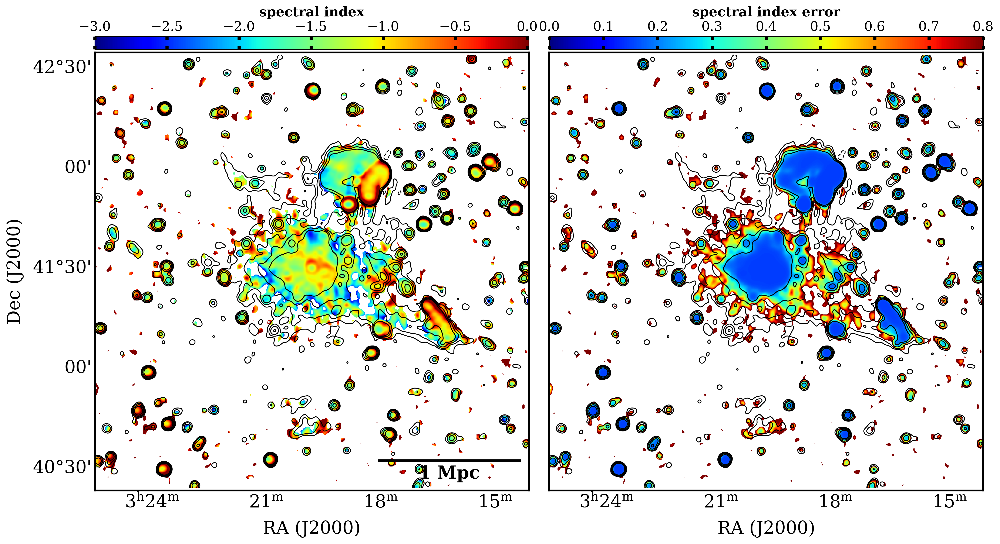

# Perseus cluster spectral analysis
Shared code for spectral analysis of the LOFAR observations of the Perseus cluster. The spectral analysis is done with the help of WSRT 327 MHZ observations.

Steps followed
1. Correct WSRT for missing short spacings (Braun & Walterbos, 1985)
2. Apply primary beam correction on WSRT images
3. regrid WSRT 22 arcsec to LOFAR 6 arcsec map
4. smooth both images to a common resolution
5. Derive spectral index and error maps analytically

### Repository structure
    📦Perseuscluster_spectralanalysis
    ┣ 📂contours                                        --> WSRT image contour files to be used by short spacing correction method ( jupyter notebook)
    ┣ 📂results                                         --> Results
    ┣ 📂src                                             --> Source code
    ┃ ┣ 📜WSRT_missing_shortspacing_correction.ipynb    --> Short spacing correction method for the WSRT 327 map as a notebook
    ┃ ┣ 📜plotting.py                                   --> Plotting script to generate spectral index maps
    ┃ ┣ 📜shortspacing_correction.py                    --> SSP correction script (NOT TESTED YET!)
    ┃ ┗ 📜spectral_analysis.py                          --> Spectral analysis script.

### Spectral index error calculation
Uncertainty in flux is defined, as follows:

$$\Delta S = \sqrt{(fS)^2 + (\sigma_{rms})^2 + (\sigma_{bowl})^2}$$
where $\Delta S$ is the net uncertainty, is sum in quadrature of:

1. the noise in the map;
2. the error due to the negative bowl, which arises around the extended structures because of the missing short spacings (σbowl). This severely affects the non full resolution maps only. Its value was estimated by determining the mean value of the extracted negative bowl around the central maximum. For LOFAR this is 0. For WSRT this is -0.00046
4. the systematic flux uncertainty. For LOFAR assumed 10%, for WSRT assumed 7%.

#### the spectral index erro, can then be defined analytically as;

$$\Delta \alpha = \frac{1}{ln(\nu_{1}/\nu_{2})}\sqrt{(\Delta S_{1} / S_{1})^2 + (\Delta S_{2} / S_{2})^2}$$

### Install
This code is for Python3.7.6+. Install the dependencies for some of the casa packages [here](https://casadocs.readthedocs.io/en/latest/notebooks/introduction.html#Prerequisite-OS-Libraries). After which the packages can be installed by a simple pip install:

``pip install -r requirements.txt``

### Run 
 First correct for the negative bowl present in the WSRT image due to the missing short spacings. This repo follows [Walterbos & Braun 1985](https://adsabs.harvard.edu/full/1985A%26A...143..307B) for it. Follow the method (re-run if you wish) in the notebook (WSRT_missing_shortspacing_correction.ipynb)

 Run ``spectral_analysis.py`` for deriving the spectral index. Run it with ``--help`` tag to see the required input types. 

 ``python spectral_analysis.py --help``

Plot with ``plotting.py`` for create maps spectral index and spectral index error. Run it with ``--help`` tag to see the required input types. 

 ``python plotting.py --help``

 ### Results

 